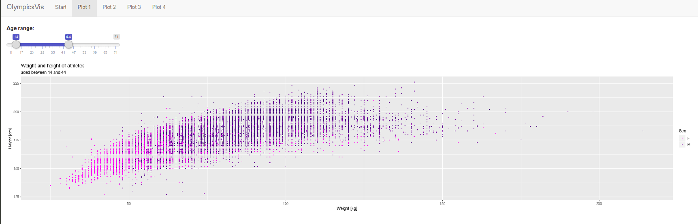
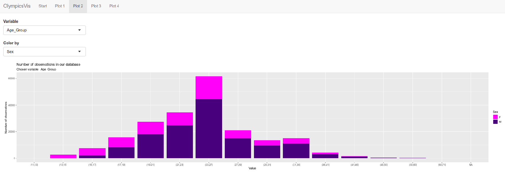

# OlympicsVis
### Shiny application and R functions to explore data about Olympic Games

The example plot shows distributions of athletes aged between 19 and 23 across different olympic disciplines. The x-axis corresponds to weight and the y-axis to height. 

.png)
**Fig. 1:** plot4

Shiny app lets the user choose age range.
Filters for categorical variables like sport, decade and team will be added.

 
**Fig. 2:** plot1

Plot 2 panel shows the histogram of chosen categorical variable in our dataset.

**Fig. 3:** plot2

Plot 3 panel will show changes in weight and height dependencies over time.
User will be able to filter dataset by sport, sex and other categorical variables.
Different colors of lines will show different groups (i.e. sports) chosen by user.

### About dataset
https://www.kaggle.com/heesoo37/120-years-of-olympic-history-athletes-and-results

